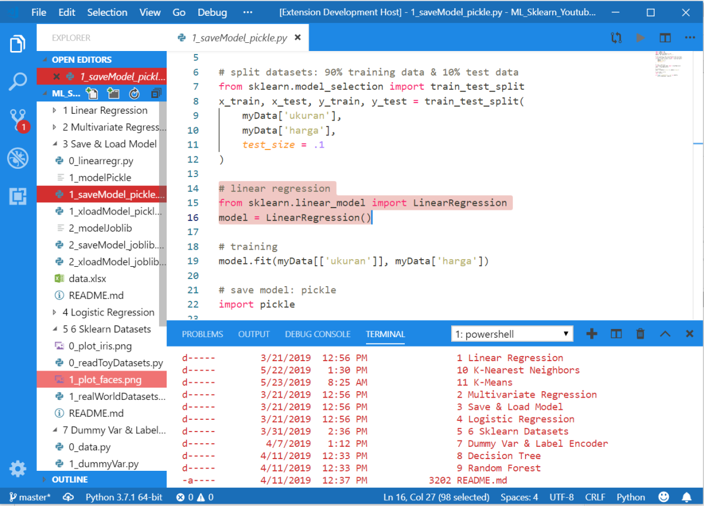

# Hello Captain America fans!

Captain America is a fictional superhero appearing in American comic books published by Marvel Comics. Created by cartoonists Joe Simon and Jack Kirby in 1940-s, the character wears a costume bearing an American flag motif, and he utilizes a nearly indestructible shield which he throws as a projectile. Captain America is the alter ego of Steve Rogers, a frail young man enhanced to the peak of human perfection by an experimental serum to aid the United States government's efforts in World War II. Near the end of the war, he was trapped in ice and survived in suspended animation until he was revived in the present day. Although Captain America often struggles to maintain his ideals as a man out of his time with its modern realities, he remains a highly respected figure in his community which includes becoming the long-time leader of the Avengers.

- Download theme: [VScode Captain America Theme]().
- Source code: [VScode Captain America Theme Source Code](https://github.com/LintangWisesa/VScode-Captain-America-Theme).

## Preview 🔍

#

#### Lintang Wisesa 💌 _lintangwisesa@ymail.com_

[Facebook](https://www.facebook.com/lintangbagus) | 
[Twitter](https://twitter.com/Lintang_Wisesa) |
[Google+](https://plus.google.com/u/0/+LintangWisesa1) |
[Youtube](https://www.youtube.com/user/lintangbagus) | [GitHub](https://github.com/LintangWisesa) |
[Hackster](https://www.hackster.io/lintangwisesa)